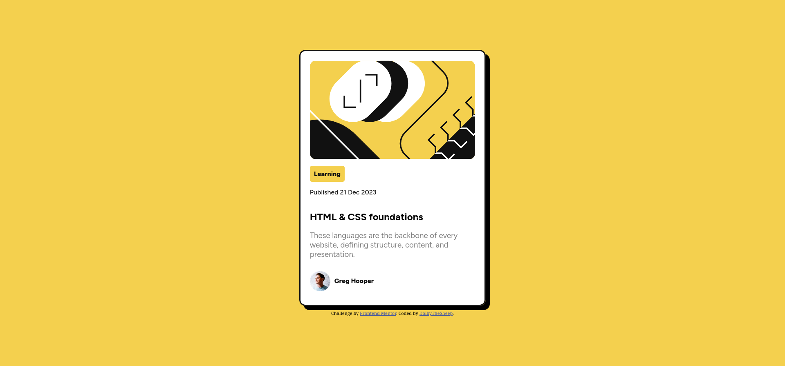
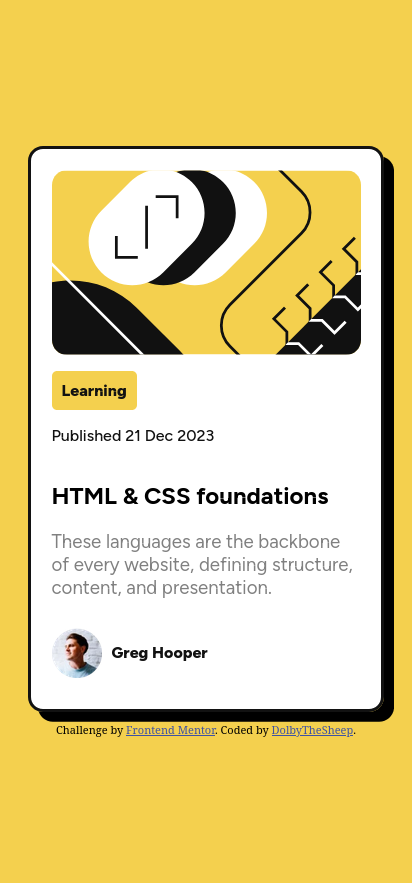

# Frontend Mentor - Blog preview card solution

This is a solution to the [Blog preview card challenge on Frontend Mentor](https://www.frontendmentor.io/challenges/blog-preview-card-ckPaj01IcS). Frontend Mentor challenges help you improve your coding skills by building realistic projects. 

## Table of contents

- [Overview](#overview)
  - [The challenge](#the-challenge)
  - [Screenshot](#screenshot)
  - [Links](#links)
- [My process](#my-process)
  - [Built with](#built-with)
  - [What I learned](#what-i-learned)

## Overview

### The challenge

Users should be able to:

- See hover and focus states for all interactive elements on the page

### Screenshot

| Desktop                                         |           Mobile                               |
|-------------------------------------------------|------------------------------------------------|
|||

### Links

- Solution URL: [github.com/DolbyTheSheep/Blog-Preview-Card.git](https://github.com/DolbyTheSheep/Blog-Preview-Card.git)
- Live Site URL: [dolbythesheep.github.io/Blog-Preview-Card/](https://dolbythesheep.github.io/Blog-Preview-Card/)

## My process

### Built with

- Semantic HTML5 markup
- CSS custom properties
- Flexbox

### What I learned

I managed to apply what I learned in the previous project building this one without any problems.